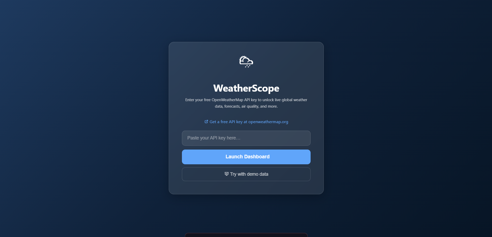
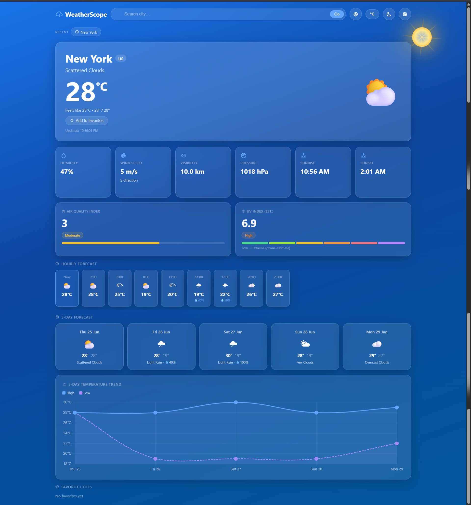

# 🌦 WeatherScope


A modern and interactive weather dashboard built using HTML, CSS, and JavaScript. WeatherScope provides real-time weather updates, forecasts, air quality information, and beautiful weather-based visual effects in a responsive glassmorphism interface.

## 🚀 Live Demo

🔗 https://vishalvivek14332-source.github.io/weatherscope/

---

## ✨ Features

### 🌤 Weather Information

* Real-time weather updates
* Current temperature and conditions
* Feels-like temperature
* Humidity monitoring
* Wind speed and direction
* Visibility information
* Atmospheric pressure
* Sunrise and sunset times

### 📅 Forecasts

* 5-Day Weather Forecast
* Hourly Weather Forecast
* Interactive Temperature Trend Chart

### 🌍 Smart Features

* Search weather for any city worldwide
* Geolocation support
* Favorite cities management
* Recent search history
* Air Quality Index (AQI)
* UV Index monitoring

### 🎨 User Experience

* Modern Glassmorphism UI
* Dynamic Weather-Based Backgrounds
* Dark / Light Mode
* Weather Animations
* Responsive Design
* Interactive Charts
* Smooth Transitions and Effects

---

## 📸 Screenshots

### Landing Page



### Weather Dashboard



---

## 🛠 Technologies Used

| Technology         | Purpose               |
| ------------------ | --------------------- |
| HTML5              | Application Structure |
| CSS3               | Styling & Animations  |
| JavaScript (ES6+)  | Functionality         |
| OpenWeatherMap API | Weather Data          |
| Chart.js           | Data Visualization    |

---

## 📂 Project Structure

```text
weatherscope/
│
├── index.html
├── README.md
├── LICENSE
├── .gitignore
│
└── assets/
    └── screenshots/
        ├── landing-page.png
        └── dashboard.png
```

---

## ⚙️ Installation

### Clone the Repository

```bash
git clone https://github.com/vishalvivek14332-source/weatherscope.git
```

### Navigate to Project Folder

```bash
cd weatherscope
```

### Run the Application

Simply open:

```text
index.html
```

in your browser.

---

## 🌟 Highlights

* Beautiful Glassmorphism Design
* Real-Time Weather Data
* Dynamic Background Effects
* Air Quality Monitoring
* UV Index Tracking
* Interactive Charts
* Mobile-Friendly Layout
* Favorite Cities Support

---

## 🔮 Future Improvements

* Weather Maps Integration
* Progressive Web App (PWA)
* Weather Alerts & Notifications
* Multi-Language Support
* Weather-Based Outfit Suggestions
* Advanced Forecast Analytics

---

## 🤝 Contributing

Contributions are welcome.

1. Fork the repository
2. Create a feature branch
3. Commit your changes
4. Push to your branch
5. Open a Pull Request

---

## 📄 License

This project is licensed under the MIT License.

---

## 👨‍💻 Author

**Vishal Vivek**

GitHub: https://github.com/vishalvivek14332-source

⭐ If you like this project, consider starring the repository.
